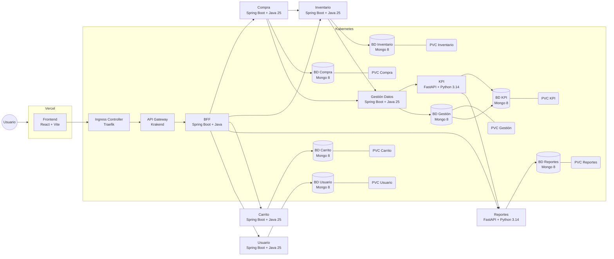

# Fullstack-3-Grupo-Cordillera

Proyecto fullstack desarrollado por el Grupo Cordillera. Contiene un frontend en React (Vite) y dos microservicios backend en Spring Boot que usan MongoDB.

## Contenido
- `front/` – Aplicación frontend (React + Vite)
- `inventario/` – Servicio backend Inventario (Spring Boot, MongoDB)
- `login/` – Servicio backend Login (Spring Boot, MongoDB)

## Stack tecnológico

- Frontend:
  - React 19
  - Vite
  - react-router-dom
  - Desarrollo con Node.js / npm

- Backend (cada servicio):
  - Java (versión en los `pom.xml`: 25)
  - Spring Boot (starter parent 4.x)
  - MongoDB (drivers Spring Data MongoDB)
  - Lombok (opcional en tiempo de compilación)

## Requisitos previos

- Node.js (recomendado >= 18)
- npm
- Java (según `pom.xml` — la configuración actual indica `java.version=25`; usar la JDK que prefieras compatible)
- Maven (o usar el wrapper `mvnw` / `mvnw.cmd` incluido)
- MongoDB corriendo localmente o una URI accesible

## Configuración y ejecución

1) Frontend

```bash
cd front
npm install
npm run dev
```

El frontend usa Vite y servirá típicamente en `http://localhost:5173` (por defecto de Vite).

2) Backend — `inventario` y `login`

Cada servicio es una aplicación Spring Boot. En Windows puedes usar el wrapper:

```powershell
cd inventario
.\mvnw.cmd spring-boot:run
# en otra terminal
cd login
.\mvnw.cmd spring-boot:run
```

O con Maven instalado:

```bash
mvn -f inventario spring-boot:run
mvn -f login spring-boot:run
```

Por defecto Spring Boot usa el puerto `8080`. Si ambos servicios arrancan sin configurar puertos específicos, habrá conflicto. Se recomienda configurar `server.port` en `src/main/resources/application.yaml` de cada servicio (por ejemplo `8081` y `8082`).

### MongoDB

Los `application.yaml` actuales apuntan a URIs locales:

- `inventario`: `mongodb://localhost:27017/inventario_bd`
- `login`: `mongodb://localhost:27017/login_bd`

Si usas un servicio remoto, puedes cambiar estas URIs o proporcionar la variable de entorno correspondiente que uses en tu configuración.

## Variables de entorno sugeridas

- `SPRING_DATA_MONGODB_URI` o configurar `spring.mongodb.uri` en `application.yaml`.
- `SERVER_PORT` (o `server.port` en `application.yaml`) para cambiar puertos de los servicios.

## Estructura del repositorio

- `front/` — código fuente del cliente React
- `inventario/` — microservicio Inventario (Java/Spring)
- `login/` — microservicio Login (Java/Spring)

## Testing

Para ejecutar pruebas unitarias en los servicios Java:

```bash
mvn -f inventario test
mvn -f login test
```

## Contribuir

1. Crear una rama (`git checkout -b feature/mi-cambio`)
2. Hacer commits pequeños y claros
3. Abrir un Pull Request describiendo el cambio

## Diagrama de draw.io


## Trello 
[📋 Acceder al Tablero de Gestión (Trello) - Grupo Cordillera](https://trello.com/invite/b/67f58f82a158aeba95daa089/ATTI81f05e6842618d1af0297687e8fd257eA1481734/fullstack-3)





